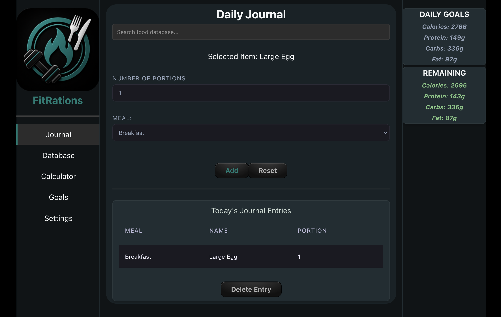

## Disclaimers
- FitRations is currently undergoing active development. You can expect some bugs and issues as this project moves along.
- This application currently has no authentication mechanism and should **not** be openly exposed to the Internet.

## About the Project

### **Current Version:** v0.2.0

FitRations is a self hosted nutrition manager that puts you in control of your food and goals. The backend for FitRations is written in Python using FastAPI. Data related to foods, your personal journal and goals are conveniently in a single SQLite database file that you can backup as you see fit. The frontend is written using React/JavaScript. As it is web-based, it acts as a website for easy management of your nutritional journal and can be hosted locally or via a VPS. This project does not now, nor will ever, collect telemetry or promote ads and there is no plan to add any sort of AI functionality.

This project started as a solution to a problem I had personnally of not wanting another subscription, being frustrated with spreadsheets and being tired of everything collecting data. This was ultimately a learning journey to help promote more coding experience, while also solving my fitness nutrition tracking problem.

## Installation
Before installing, ensure you are running the latest version of Docker. Then, download the docker-compose.yaml file and modify it to fit your requirements. The current variable settings are fairly minimal at this time.

## Env Params

| **Name** | **Value** | **Example** |  
| --- | --- | --- |  
| DB_PATH | Full path location of where you wish your database file to be held. Unless changes in the volumes setting, /app will map to the current directory you are creating the container from so a container started in ~/user/fitrations will make its DB file in ~/user/fitrations/data/ | /app/data/fitrations.db |  
| BACKUP_DIR | Full path where you want your database backup files saved | /app/data/backups |  
| TIME_ZONE | Sets the timezone for journal entries. Must be identified by IANA Time Zones | America/New_York |  
| ALLOWED_ORIGINS | Sets the allowed origins of what can contact the backend API. The server IP and port number should match the container port mapping in PORTS. | http://yourdomain.com,http://your-server-ip:8080 |  
| PORTS | Sets the container listening port mapped to the internal nginx listening port in a "CONTAINER:INTERNAL" mapping. The internal port should always be port 80. | "8080:80" |  
| VOLUMES | Sets the container volume for storage in a SYSTEM:CONTAINER dynamic. The internal mapping should always be /app/data. | ./data:/app/data |  

## Start the Container

Once your variables are set, simply start the container with your configuration settings by running the following in the folder with the compose file.

```sh
docker compose up -d
```

## License
Distributed under the GNU GPLv3 license. 
